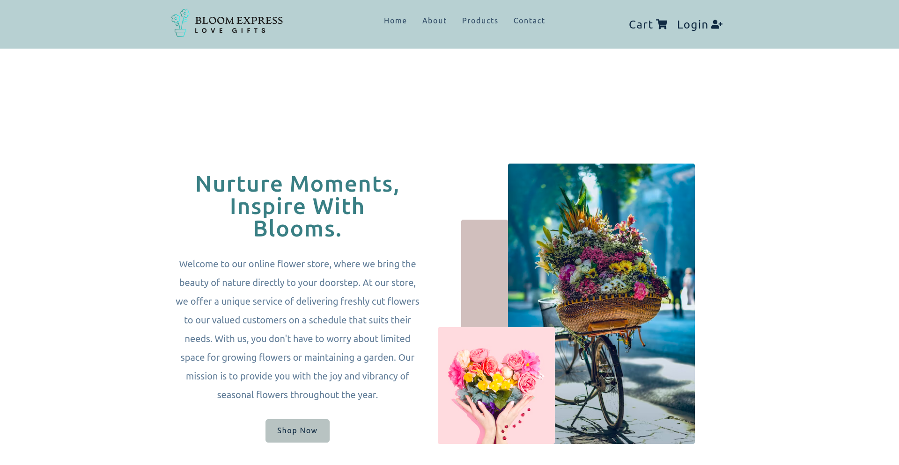

# BloomExpress


Welcome to Bloom Express, where the beauty of flowers meets the convenience of online shopping. Our goal is to provide customers with a user-friendly platform to explore and purchase exquisite bouquets. This project was developed as a group effort during the Final Project of the DCI Further Training program as Web & Software Developers.

## Table of Contents

- [Introduction](#introduction)
- [Contributors](#contributors)
- [Project Structure](#project-structure)
- [Directory Structure](#directory-structure)
- [Features](#features)
- [Installation](#installation)
- [Usage](#usage)
- [Deployed Version](#deployed-version)
- [Test Card Numbers](#test-card-numbers)
- [Technologies Used](#technologies-used)
- [UI/UX Design & Task Management](#uiux-design--task-management)
- [Screenshot: Bloom Express Homepage](#screenshot-bloom-express-homepage)

## Introduction

Bloom Express is a delightful online store for flower enthusiasts, providing a seamless shopping experience for beautiful bouquets.

## Contributors: Blooming Developers

- Apiradee Haeusler - https://github.com/ApiradeeH
- Marko Tertinek - https://github.com/MarkoTertinek
- Manolos Cipi - https://github.com/manoloscipi
- Jime Rowe - https://github.com/JimeRowe
- Sayed Jamal Hussain Ahmadi - https://github.com/coderahmadi

## Project Structure

Bloom Express follows a modular structure, implementing the MVC (Model-View-Controller) pattern. The backend is organized into separate folders for models, controllers, routes, and middleware.

## Directory Structure

<pre>
bloom-express/
│
├── backend/
│ ├── controllers/
│ ├── models/
│ ├── routes/
│ └── middleware/
│
├── client/
│ ├── public/
│ └── src/
│ ├── components/
│ ├── pages/
│ └── assets/
│
└── server.js
</pre>

Briefly, here's an explanation of each directory:

- **backend/controllers:** Contains controllers that handle business logic.
- **backend/models:** Defines data models.
- **backend/routes:** Defines API routes.
- **backend/middleware:** Houses middleware functions.

- **client/public:** Public assets for the React frontend.
- **client/src/components:** Reusable React components.
- **client/src/pages:** Components representing different pages.
- **client/src/assets:** Assets used in the frontend, such as images.

### MVC Pattern

Bloom Express uses the MVP (Model-View-Presenter ) pattern to separate concerns and enhance maintainability and scalability.

## Features

- **Secure Authentication:** Implemented Auth0 for user authentication to ensure secure access to the platform.

- **Stripe Payment Integration:** Seamless integration with Stripe for secure and efficient payment processing.

- **Personalized Greeting Cards:** After successful payments, a unique greeting card is generated for each order, enhancing the customer experience.

- **Responsive Design:** A visually appealing and responsive design to provide a consistent experience across devices.

## Installation

To get started with Bloom Express on your local machine, follow these steps:

1. **Clone the repository:**

   ```bash
   git clone https://github.com/BloomExpress/bloom-express.git
   ```

2. Set up environment variables:

- Create a .env file in the backend and add the necessary variables

- Ensure you have the following environment variables set up in your backend:

- `DB_CONNECTION`: MongoDB connection string for storing product and user information.
- `PORT`: Port on which the server runs.
- `JWT_KEY`: Secret key for JWT token generation.
- `STRIPE_API_KEY`: Stripe API key for payment processing.

3. Run the server: `npm i && nodemon server`
4. Access the application: `cd client && npm i && npm run dev`

## Deployed Version

The deployed version of Bloom Express can be found [here](https://bloom-express.onrender.com)

## Test Card Numbers:

- Stripe provides test card numbers that you can use for testing payments. Here are some common test card numbers for Stripe:

1. Visa: 4242 4242 4242 4242
2. MasterCard: 5555 5555 5555 4444
3. American Express: 3782 822463 10005
4. Discover: 6011 1111 1111 1117
5. JCB: 3566 0020 2036 0505
6. Diners Club: 3056 9309 0259 04

## Technologies Used

- MongoDB: Database for storing product and user information.
- Express.js: Backend framework for building the server.
- React: Frontend library for building the user interface.
- Node.js: Runtime environment for executing server-side code.
- Auth0: Authentication and authorization platform.
- Stripe: Payment gateway for secure and efficient payment processing.
- styled-components
- Bootstrap5

## UI/UX Design & Task Management

- Figma
- Trello
- Lighthouse

## Screenshot: Bloom Express Homepage

This screenshot captures the Bloom Express homepage, showcasing a visually appealing layout with featured bouquets. The navigation bar provides easy access to different sections of the online store. Additionally, the responsive design ensures a seamless experience across various devices.


